# Next Release AI MCP Server - Architecture Diagram

This architecture diagram shows the complete system structure, component relationships, and external integrations.

```mermaid
flowchart TB
    subgraph "Entry Points"
        EP1[dual-server.ts<br/>MCP Server Entry]
        EP2[server.ts<br/>HTTP Server Entry]
        EP3[index.ts<br/>CLI Entry]
    end

    subgraph "Core Framework"
        CF1[MCPToolFactory<br/>Tool Resolution]
        CF2[BaseMCPTool<br/>Base Implementation]
    end

    subgraph "Tool Layer"
        TL1[ComprehensiveWorkflowTool<br/>End-to-End Release Process]
        TL2[SprintReviewTool<br/>Sprint Analysis]
        TL3[ShareableReportTool<br/>Report Generation]
        TL4[StoryPointsAnalysisTool<br/>Velocity Analysis]
        TL5[TeamsIntegrationTool<br/>Notification Management]
        TL6[VelocityAnalysisTool<br/>Performance Metrics]
    end

    subgraph "Service Layer"
        SL1[EnhancedJiraService<br/>JIRA API Integration]
        SL2[GitHubService<br/>GitHub API Integration]
        SL3[ConfluenceService<br/>Confluence Publishing]
        SL4[TeamsService<br/>Teams Notifications]
        SL5[AzureDevOpsService<br/>Azure DevOps Integration]
        SL6[ReleaseNotesService<br/>Content Generation]
        SL7[FileService<br/>File Operations]
        SL8[TopContributorsAnalyzer<br/>Contributor Analysis]
        SL9[ProfessionalTeamsTemplateService<br/>Teams Templates]
    end

    subgraph "Utility Layer"
        UL1[HtmlFormatter<br/>HTML Generation]
        UL2[MarkdownFormatter<br/>Markdown Processing]
        UL3[JiraExtractor<br/>Data Extraction]
        UL4[JiraAnalyzer<br/>Data Analysis]
        UL5[BoardMappings<br/>JIRA Board Configuration]
        UL6[TeamsRichFormatter<br/>Teams Card Formatting]
    end

    subgraph "External Systems"
        ES1[JIRA<br/>Issue Tracking]
        ES2[GitHub<br/>Source Control]
        ES3[Confluence<br/>Documentation]
        ES4[Microsoft Teams<br/>Collaboration]
        ES5[Azure DevOps<br/>ALM Platform]
    end

    subgraph "Output Artifacts"
        OA1[HTML Reports<br/>Styled Release Notes]
        OA2[Markdown Files<br/>Raw Content]
        OA3[Confluence Pages<br/>Published Documentation]
        OA4[Teams Messages<br/>Notifications]
    end

    %% Entry Points to Core
    EP1 --> CF1
    EP2 --> CF1
    EP3 --> CF1

    %% Core to Tools
    CF1 --> CF2
    CF2 --> TL1
    CF2 --> TL2
    CF2 --> TL3
    CF2 --> TL4
    CF2 --> TL5
    CF2 --> TL6

    %% Tools to Services
    TL1 --> SL1
    TL1 --> SL2
    TL1 --> SL6
    TL1 --> SL7
    TL1 --> SL8
    TL1 --> SL3
    TL1 --> SL4

    TL2 --> SL1
    TL2 --> SL6
    TL2 --> SL7

    TL3 --> SL6
    TL3 --> SL7
    TL3 --> UL1

    TL4 --> SL1
    TL4 --> SL8
    TL4 --> UL1

    TL5 --> SL4
    TL5 --> SL9

    TL6 --> SL1
    TL6 --> SL8

    %% Services to Utilities
    SL1 --> UL3
    SL1 --> UL4
    SL1 --> UL5
    SL6 --> UL1
    SL6 --> UL2
    SL4 --> UL6
    SL4 --> SL9

    %% Services to External Systems
    SL1 --> ES1
    SL2 --> ES2
    SL3 --> ES3
    SL4 --> ES4
    SL5 --> ES5

    %% Services to Output
    SL6 --> OA1
    SL6 --> OA2
    SL7 --> OA1
    SL7 --> OA2
    SL3 --> OA3
    SL4 --> OA4

    %% Styling
    classDef entryPoint fill:#e1f5fe,stroke:#01579b,stroke-width:2px
    classDef core fill:#f3e5f5,stroke:#4a148c,stroke-width:2px
    classDef tool fill:#fff3e0,stroke:#e65100,stroke-width:2px
    classDef service fill:#e8f5e8,stroke:#1b5e20,stroke-width:2px
    classDef utility fill:#fce4ec,stroke:#880e4f,stroke-width:2px
    classDef external fill:#eceff1,stroke:#263238,stroke-width:2px
    classDef output fill:#fff8e1,stroke:#f57f17,stroke-width:2px

    class EP1,EP2,EP3 entryPoint
    class CF1,CF2 core
    class TL1,TL2,TL3,TL4,TL5,TL6 tool
    class SL1,SL2,SL3,SL4,SL5,SL6,SL7,SL8,SL9 service
    class UL1,UL2,UL3,UL4,UL5,UL6 utility
    class ES1,ES2,ES3,ES4,ES5 external
    class OA1,OA2,OA3,OA4 output
```

## Component Responsibilities

### Entry Points
- **dual-server.ts**: Main MCP server supporting both stdio and HTTP protocols
- **server.ts**: Standalone HTTP server for direct API access
- **index.ts**: Command-line interface for local execution

### Core Framework
- **MCPToolFactory**: Resolves and instantiates appropriate tools based on requests
- **BaseMCPTool**: Provides common functionality and interface for all tools

### Tool Layer
- **ComprehensiveWorkflowTool**: Orchestrates complete release workflow
- **SprintReviewTool**: Generates detailed sprint analysis reports
- **ShareableReportTool**: Creates shareable format reports
- **StoryPointsAnalysisTool**: Analyzes story point completion and trends
- **TeamsIntegrationTool**: Manages Teams notifications and integrations
- **VelocityAnalysisTool**: Calculates team velocity metrics

### Service Layer
- **EnhancedJiraService**: Advanced JIRA API integration with caching and analysis
- **GitHubService**: GitHub repository and commit data retrieval
- **ConfluenceService**: Content publishing to Confluence spaces
- **TeamsService**: Microsoft Teams webhook and notification management
- **ReleaseNotesService**: Content generation and formatting coordination
- **FileService**: Local file system operations and artifact management
- **TopContributorsAnalyzer**: Contributor impact analysis and ranking

### Utility Layer
- **HtmlFormatter**: HTML template processing and styling
- **MarkdownFormatter**: Markdown content processing and conversion
- **JiraExtractor/Analyzer**: JIRA data extraction and analysis utilities
- **BoardMappings**: JIRA board configuration and mapping management

## Data Flow Patterns

1. **Request Processing**: Entry points route requests through the tool factory
2. **Tool Orchestration**: Tools coordinate multiple services to fulfill requests
3. **Service Integration**: Services handle external API communications
4. **Utility Processing**: Utilities handle data transformation and formatting
5. **Artifact Generation**: Output artifacts are created in multiple formats

## Deployment Modes

- **MCP Plugin**: Integrates with GitHub Copilot via stdio protocol
- **HTTP Server**: Standalone API server for direct integration
- **CLI Tool**: Command-line interface for local execution
- **Docker Container**: Containerized deployment for cloud environments

## Configuration Management

- Environment variables for API credentials and endpoints
- Board mappings for JIRA project configuration
- Template customization for different output formats
- Service-specific configuration for external integrations
