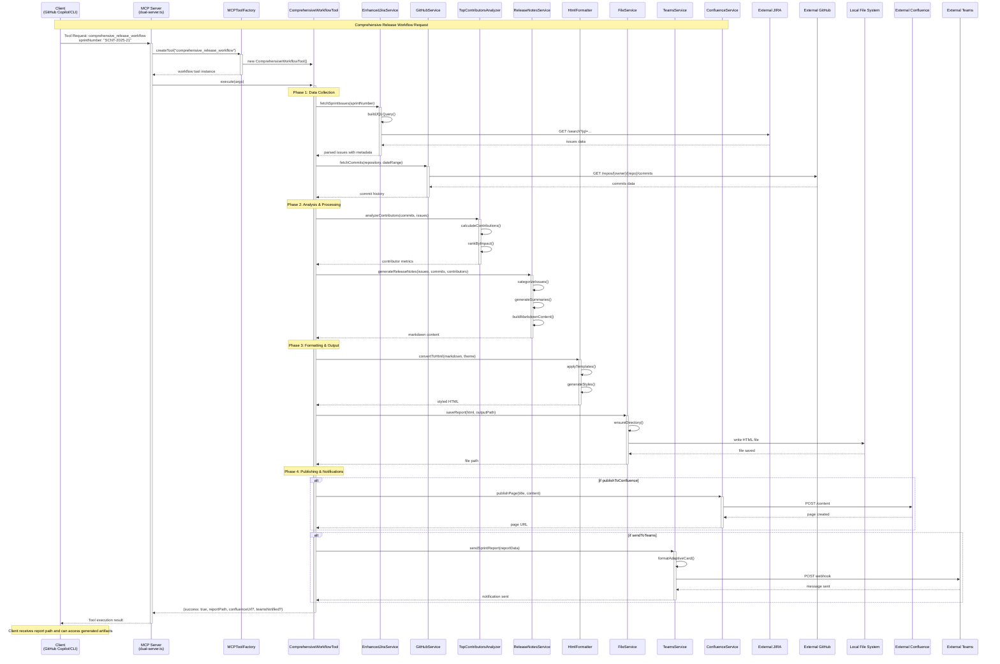

# Next Release AI MCP Server - Sequence Diagram

This sequence diagram shows the complete flow of a typical release workflow request through the Next Release AI MCP server.

## Flow Description

1. **Request Initiation**: Client (GitHub Copilot or CLI) sends a comprehensive release workflow request
2. **Tool Factory**: MCP server uses factory pattern to create appropriate tool instance
3. **Data Collection**: 
   - Fetch JIRA issues for the specified sprint
   - Retrieve GitHub commits for the same time period
4. **Analysis**: 
   - Analyze contributor metrics and impact
   - Process and categorize issues
5. **Content Generation**: 
   - Generate release notes in markdown format
   - Convert to styled HTML
6. **Output**: Save reports to local file system
7. **Publishing**: Optionally publish to Confluence and send Teams notifications
8. **Response**: Return success status and artifact locations to client

## Key Integration Points

- **JIRA Integration**: Fetches sprint issues using JQL queries
- **GitHub Integration**: Retrieves commit history and contributor data
- **Teams Integration**: Sends formatted notifications with adaptive cards
- **Confluence Integration**: Publishes release notes as pages
- **File System**: Saves all generated artifacts locally
